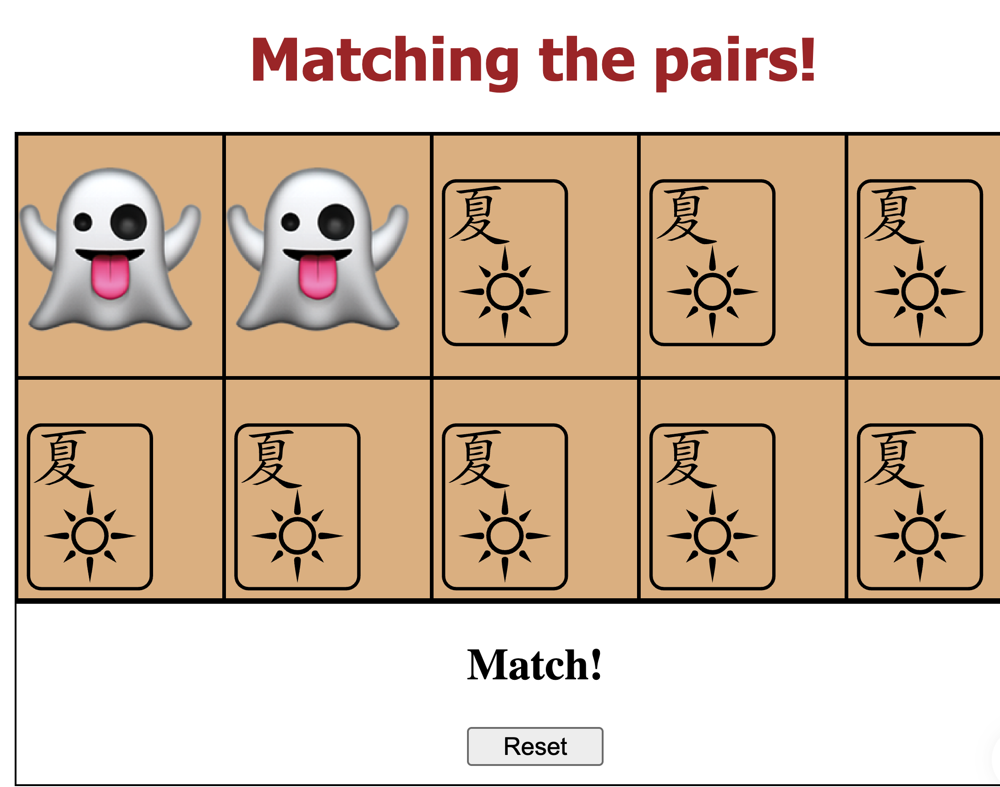
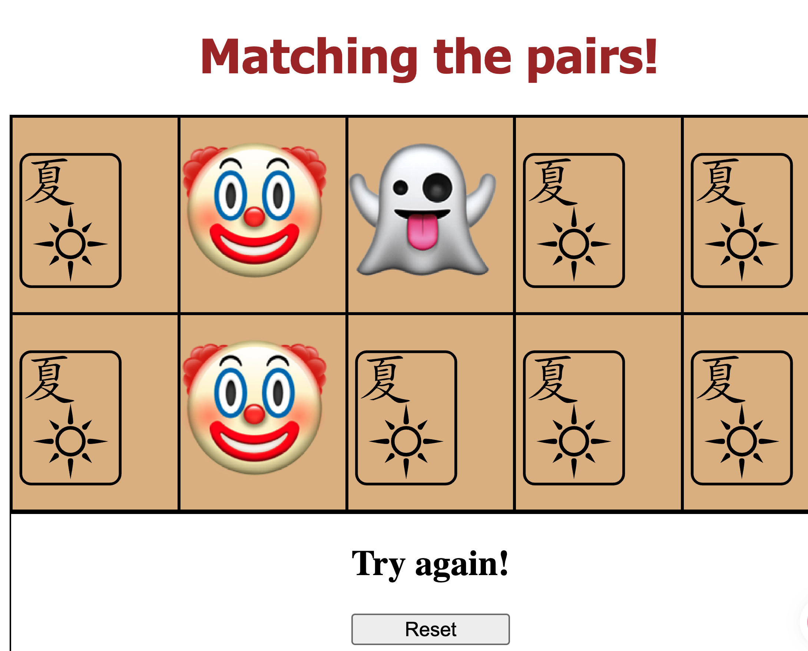

# Matching Card Game

A 10-card memory game where players flip two cards at a time and try to find all the matching pairs. 
Matched cards stay flipped, and the game is finished when every pair has been found.

## How it looks like:




## How It's Made

**Tech Used:** HTML, JavaScript

The game logic is written in vanilla JavaScript and runs entirely in the browser. 
It tracks which cards are flipped, checks whether two selected cards match, and detects when all pairs have been found.

## Getting Started

1. Clone this repository

```bash
   git clone https://github.com/sabrinalindev/matching-card.git
```

2. Open `index.html` in your browser

## How to Play

1. Click a card to flip it over
2. Click a second card
3. If the two cards match, they stay flipped
4. If they don't match, both cards flip back over
5. Keep going until all 5 pairs are matched. Game ends, you win! Otherwise, you can reset the game. 

## Features

- 10 cards (5 pairs) to match
- Two-card selection with match checking
- Matched cards stay flipped; unmatched cards flip back
- Game completes when all cards are matched
- No installation or dependencies needed

## Why This Stack

- **JavaScript**: Keeps the codebase lightweight and easy to understand, and handles all the game state and card-flip logic.
- **HTML**: Simple, fast to load, and perfect for a browser-based game with minimal dependencies.

## Optimizations：

- Add a move counter and timer
- Improve the visual design and add CSS styling

